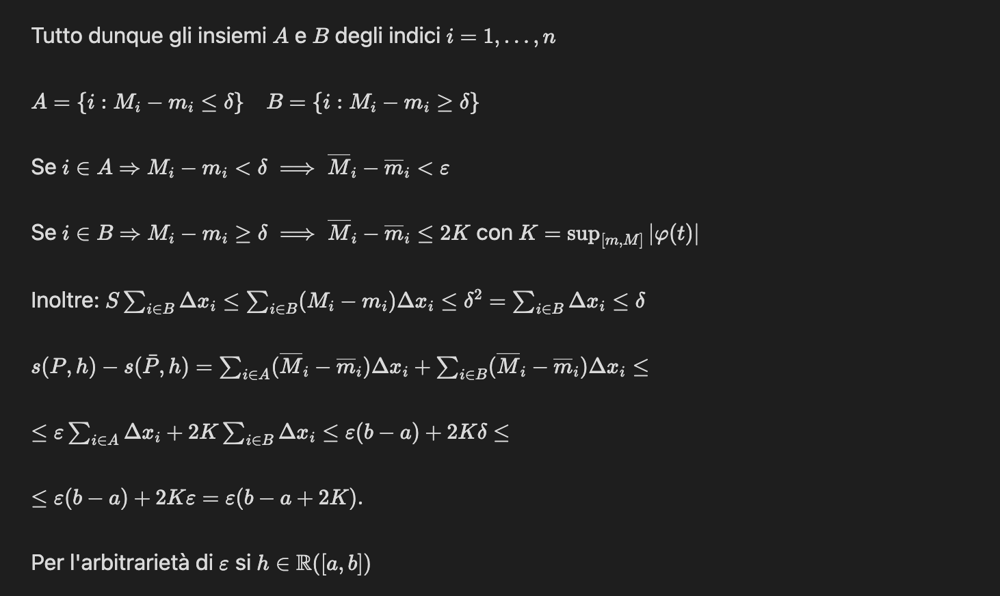
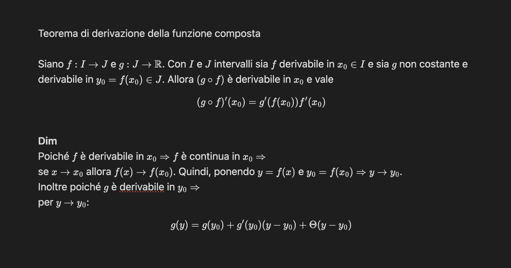

# Academic-OCR-Pipeline 🎓📈

Una pipeline automatizzata per convertire PDF accademici (appunti, dispense, libri di Analisi Matematica) in file Markdown perfettamente ottimizzati per **Obsidian**. Il progetto sfrutta la potenza di **olmOCR** per il riconoscimento del testo e la conversione intelligente delle formule matematiche.

> ### 📝 Note sullo sviluppo
> 
> 
> Questo progetto è nato da un'esigenza pratica immediata: automatizzare la digitalizzazione di appunti di Analisi Matematica. Non è inteso come un software commerciale o una libreria ufficiale, ma come una raccolta di script "utility" per facilitare il flusso di lavoro tra OCR (olmOCR) e la creazione di appunti digitali su Obsidian o progetti LaTeX (Overleaf).

### 🌟 Caratteristiche principali

* **OCR di precisione**: Conversione di documenti complessi tramite `olmOCR` e `Qwen2.5-VL`.
* **LaTeX Smart Handling**: Script dedicati per convertire i delimitatori LaTeX standard `\( \)` e `\[ \]` nei formati `$` e `$$` nativi di Obsidian.
* **Cloud Ready**: Supporto ottimizzato per Google Colab e Kaggle per sfruttare la potenza delle GPU gratuite.
* **Flessibilità**: Doppia modalità di formattazione (completa o conservativa per LaTeX).

### 📊 Performance e Risultati

La pipeline è stata testata su un dataset massivo di dispense universitarie, dimostrando una stabilità eccezionale:

* **Pagine elaborate**: 667
* **Tempo totale**: 7h 51min 04s
* **Efficienza**: Gestione automatizzata della cache e dei file temporanei per sessioni a lungo termine.

### 📁 Struttura del Progetto

* `olmocr_pipeline.py`: Il cuore della pipeline. Estrae il testo dai PDF e pulisce l'output.
* `obsidian_formatter.py`: Converte tutta la matematica (inline e display) per Obsidian.
* `latex_formatter.py`: Converte solo la matematica inline, mantenendo i blocchi `\[ \]`.
* `olmocr.ipynb`: Notebook per l'esecuzione su Google Colab.
* `kaggle_olmocr.ipynb`: Notebook ottimizzato per l'ambiente Kaggle.

---

## 📸 Anteprima della Trasformazione

Il sistema è in grado di convertire appunti manoscritti complessi in documenti digitali perfettamente formattati per la consultazione e lo studio.

### Esempio 1: Dimostrazione di Analisi (Integrazione)
| Originale (Scansione) | Output Obsidian (Rendering) |
| :--- | :--- |
|  |  |

### Esempio 2: Teorema della Funzione Composta
| Originale (Scansione) | Output Obsidian (Rendering) |
| :--- | :--- |
|  |  |

---

## 🚀 Come iniziare

1. **Installazione**:

```bash
pip install -r requirements.txt

```

2. **Esecuzione della Pipeline**:

```bash
python olmocr_pipeline.py --pdfs ./documenti --workspace ./output

```

3. **Formattazione per Obsidian**:

```bash
python obsidian_formatter.py ./output

```

---

## 🤝 Ringraziamenti

Questo progetto è stato reso possibile grazie all'incredibile lavoro di:

* **The olmOCR Team**: per aver fornito un modello allo stato dell'arte per la comprensione di documenti accademici.
* **Alibaba Qwen Team**: per il potentissimo modello vision-language Qwen2.5-VL.
* **Google Colab**: per aver messo a disposizione le risorse computazionali (GPU) necessarie in fase di prototipazione.
* **Kaggle**: per le risorse GPU fondamentali durante la fase di elaborazione massiva dei dati.
* **Gemini (Google)**: per l'assistenza alla codifica e al debugging; il supporto dell'AI è stato prezioso, sebbene la **supervisione umana** sia stata indispensabile per correggere errori critici e rendere il codice realmente funzionale.
* **The Obsidian Community**: per aver creato il miglior ecosistema per la gestione della conoscenza.

---

*Developed with ❤️ for students and researchers.*

---
